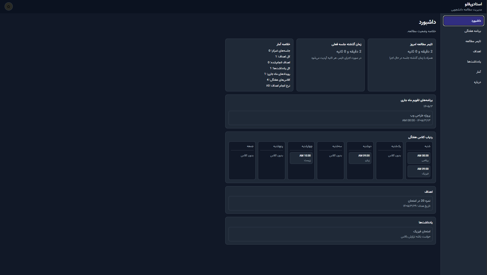
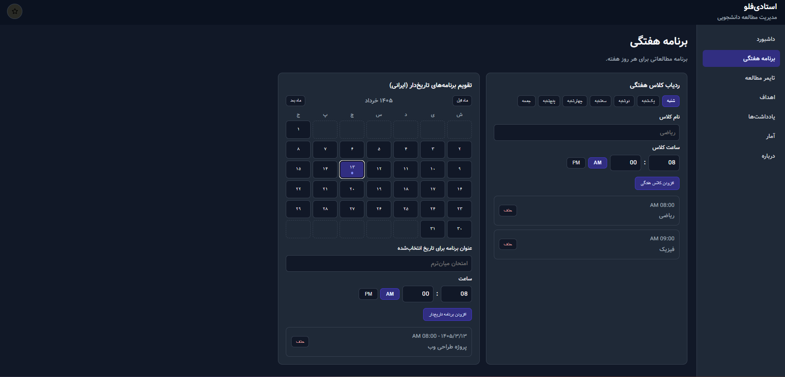
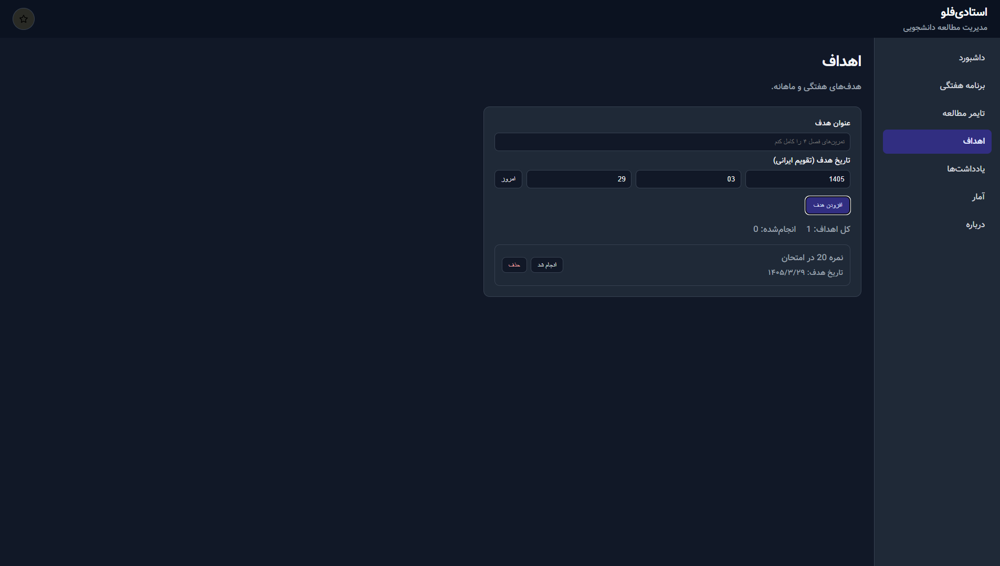
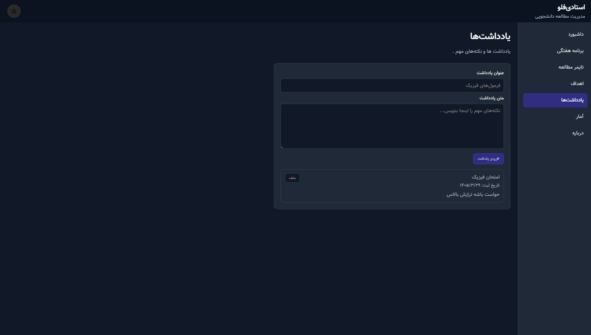
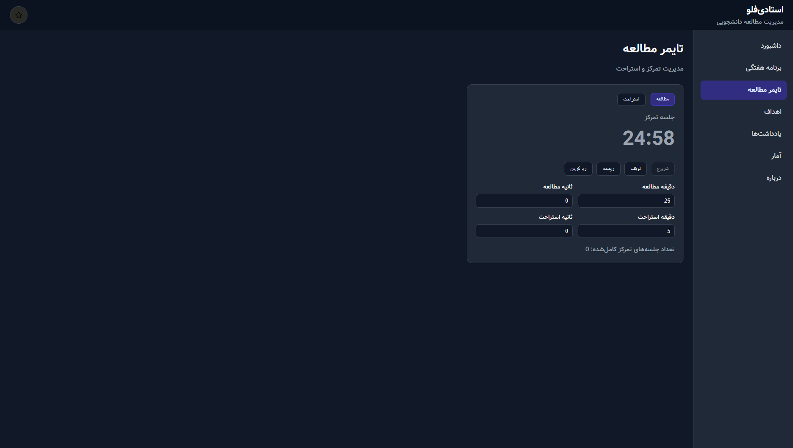
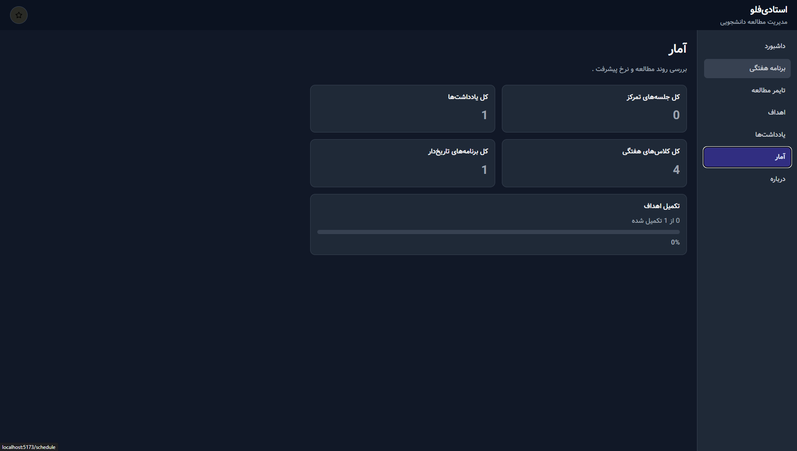
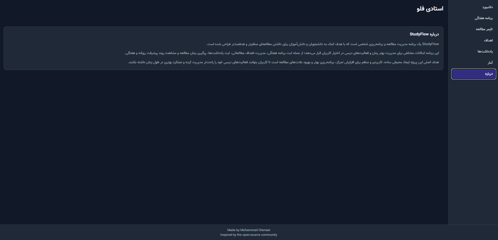

# StudyFlow

### Created by Mohammad Olamaei

A simple React study tracker for students.

## Screenshots

### Dashboard



### Weekly & Monthly Schedule



### Goals



### Notes



### Timer



### Statistics



### About Page



## Features

* Weekly schedule planner

  * Add classes for each day of the week
  * Keep a clear weekly class tracker
* Monthly calendar planning

  * Add date-based study events
  * View monthly calendar items quickly from dashboard
* Goals tracker

  * Create study goals
  * Mark goals as completed and track progress
* Notes section

  * Save quick study notes and reminders
  * Keep recent notes visible on dashboard
* Study timer

  * Focus timer with study/break modes
  * Supports minute/second settings and AM/PM-related schedule flow
  * Stores study time with LocalStorage
* Statistics summary

  * Track completed sessions and goal completion rate
  * See study progress from dashboard cards
* Dark mode

  * Toggle between light and dark themes

## Tech Stack

* React
* JavaScript
* HTML
* CSS
* LocalStorage

## Run the Project

```bash
npm install
npm start
```

## Credits / Inspiration

* Built with help of ChatGPT (GPT-5.2 and GPT-5.3)
* CSS was significantly improved with AI assistance
* Some parts of React logic were built with help of GPT
* Inspired by study tracker websites like studiessimer.com
* Based on YouTube tutorials:

  * https://www.youtube.com/watch?v=SuBoFUOfc9w
  * https://www.youtube.com/watch?v=pQoHvx0SoiA&list=PLmH3H5AWQftD_T9yEZNfvttwZ-x6CLH6j
* Project was initially started about a year ago and completed this month
* Built as a personal student project for practice and real daily use

## License

This project is licensed under the MIT License. See the `LICENSE` file for details.

The License context was made using AI.
